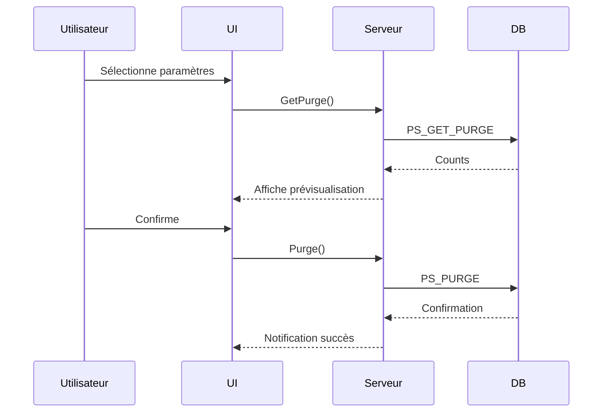

# Documentation Technique - Module de Purge

## 1. Vue d'ensemble
Cette page permet aux administrateurs de purger les données du système CADIMEL selon des critères spécifiques (émetteur et date). Elle offre deux fonctions principales :
- Visualisation préalable des données à purger
- Exécution effective de la purge

## 2. Méthodes principales

### `Page_Load(object sender, EventArgs e)`
**Rôle** : Initialisation de la page  
**Fonctionnement** :
```csharp
// Vérification des droits
if (!userData.isAccess(1)) {
    Response.Redirect("accueilUser.aspx"); // Redirection si non autorisé
}

// Connexion à la base
maConnexion.ConnectionString = ConfigurationManager.AppSettings["ConnexionString"];
maConnexion.Open();

// Chargement initial
if (!IsPostBack) {
    UpdateEmetteur(); // Remplit le dropdown des émetteurs
}
```
**Sécurité** :  


---

### `UpdateEmetteur()`
**Rôle** : Peuple la liste déroulante des émetteurs  
**Processus** :
1. Exécute la procédure stockée `PS_GetAllEmetteur`
2. Transforme les résultats en DataTable
3. Lie les données au DropDownList

**Structure des données** :
```sql
-- PS_GetAllEmetteur retourne :
code_emetteur (Text affiché) | code_emetteur (Valeur)
----------------------------------------------
EMETTEUR_A                   | EMETTEUR_A
EMETTEUR_B                   | EMETTEUR_B
```

---

### `GetPurge(object sender, EventArgs e)`
**Rôle** : Prévisualisation des données à purger  
**Paramètres** :
- `@date` : Date sélectionnée
- `@emetteur` : Émetteur sélectionné

**Workflow** :
```csharp
SqlCommand cmd = new SqlCommand("PS_GET_PURGE", maConnexion);
cmd.Parameters.AddWithValue("@date", dateDebut.Text);
cmd.Parameters.AddWithValue("@emetteur", DropdownEmetteur.Text);

using (SqlDataReader resultat = cmd.ExecuteReader()) {
    if (resultat.Read()) {
        PurgePrisEnCharge.Text = resultat.GetInt32(0).ToString(); // Compte pris en charge
        PurgeNonPrisEnCharge.Text = resultat.GetInt32(1).ToString(); // Compte non pris en charge
    }
}
```
**Sortie typique** :  


---

### `Purge(object sender, EventArgs e)`
**Rôle** : Exécute la purge effective  
**Validation** :
```csharp
if (string.IsNullOrEmpty(PurgeNonPrisEnCharge.Text) || 
    string.IsNullOrEmpty(PurgePrisEnCharge.Text)) {
    // Affiche notification d'erreur
    ScriptManager.RegisterStartupScript(..., "notyfBox();");
    return;
}
```

**Exécution** :
```csharp
SqlCommand cmd = new SqlCommand("PS_PURGE", maConnexion);
cmd.Parameters.AddWithValue("@date", dateDebut.Text);
cmd.Parameters.AddWithValue("@emetteur", DropdownEmetteur.Text);

cmd.ExecuteNonQuery(); // Exécute sans retour
ScriptManager.RegisterStartupScript(..., "notyfBoxValid();"); // Confirmation
ResetCounters(); // Réinitialise l'affichage
```

---

## 3. Procédures Stockées

### `PS_GET_PURGE`
**Rôle** : Retourne les comptages avant purge  
**Sortie** :
- Colonne 0 : Nombre d'éléments pris en charge
- Colonne 1 : Nombre d'éléments non pris en charge

### `PS_PURGE` 
**Rôle** : Exécute la purge effective  
**Paramètres** : Identiques à PS_GET_PURGE  
**Action** : Modification physique des données

---

## 4. Interface Utilisateur

### Structure ASPX
```html
<asp:DropDownList ID="DropdownEmetteur" runat="server" />
<asp:TextBox ID="dateDebut" runat="server" TextMode="Date" />

<asp:Button runat="server" OnClick="GetPurge" Text="Prévisualiser" />
<asp:Button runat="server" OnClick="Purge" Text="Exécuter la purge" />

<asp:Label ID="PurgePrisEnCharge" runat="server" />
<asp:Label ID="PurgeNonPrisEnCharge" runat="server" />
```

### Flux Utilisateur
1. Sélectionner un émetteur et une date
2. Cliquer sur "Prévisualiser"
3. Vérifier les comptages
4. Cliquer sur "Exécuter la purge"

---

## 5. Gestion des Erreurs

**Problèmes courants** :
- Connexion DB échouée → Redirection
- Paramètres vides → Notification
- Échec procédure stockée → Silent fail (à améliorer)

**Amélioration suggérée** :
```csharp
try {
    // Opération critique
} catch (SqlException ex) {
    Logger.Error($"Purge failed: {ex.Message}");
    ShowNotification("Erreur technique", "error");
}
```

---

## 6. Diagramme de Séquence



---

## 7. Bonnes Pratiques

1. **Validation** :
```csharp
// Avant purge
if (DateTime.Parse(dateDebut.Text) > DateTime.Now) {
    // Bloquer les dates futures
}
```

2. **Journalisation** :
```csharp
// Ajouter dans PS_PURGE
INSERT INTO purge_log (user_id, emetteur, date, count)
VALUES (...);
```

3. **Sécurité** :
```sql
-- Dans les procédures
EXECUTE AS CALLER -- Limite les droits
```

Cette documentation couvre l'ensemble du workflow de purge avec :
- Les mécanismes techniques
- Les flux de données
- Les points d'amélioration
- Les interactions système
