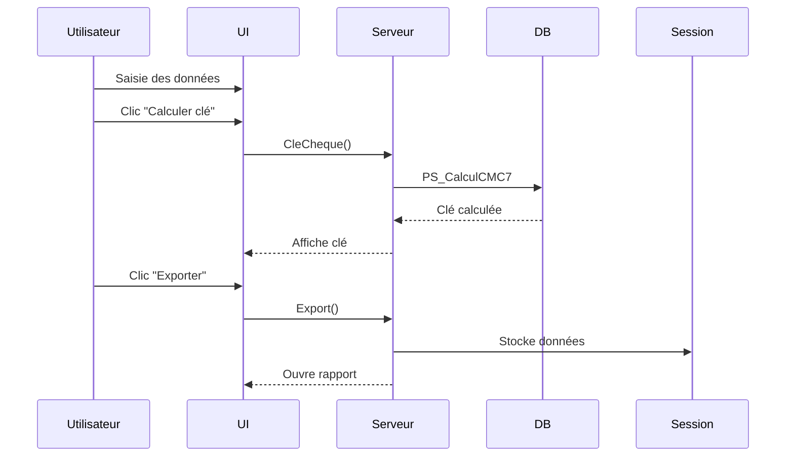

# Documentation Technique - Module de Saisie de Chèque

## 1. Vue d'ensemble
Cette page permet la saisie et la validation des informations relatives aux chèques dans le système CADIMEL. Elle offre deux fonctionnalités principales :
- Calcul de la clé de contrôle d'un chèque (CMC7)
- Export des informations vers un rapport

## 2. Structure du code

### Classe principale
```csharp
public partial class SaisieCheque : System.Web.UI.Page
{
    public SqlConnection maConnexion = new SqlConnection();
    LoginUser userData = new LoginUser();
    
    protected void Page_Load(object sender, EventArgs e)
    {
        if (!userData.isAccess(1)) {
            Response.Redirect("accueilUser.aspx");
        }
    }
}
```

## 3. Méthodes principales

### `Export(object sender, EventArgs e)`
**Rôle** : Valide et exporte les données du chèque  
**Workflow** :
1. Validation des champs obligatoires
2. Vérification des formats (longueurs fixes)
3. Stockage en session
4. Ouverture du rapport

```csharp
// Validation des champs vides
if (TextBoxNumCheque.Text == "" || TextBoxInterbancaire.Text == "" || TextBoxInterne.Text == "")
{
    ScriptManager.RegisterStartupScript(..., "notyfBox();"); // Notification erreur
    return;
}

// Validation des longueurs
else if (TextBoxNumCheque.Text.Length != 7 || ...)
{
    ScriptManager.RegisterStartupScript(..., "notyfBox2();"); // Notification format
    return;
}

// Stockage en session
Session["TextBoxNumCheque"] = TextBoxNumCheque.Text;
Session["Cle"] = LabelCleCheque.Text;

// Ouverture rapport
ScriptManager.RegisterStartupScript(..., $"openNewWinReporting('{url}');");
```

**Règles de validation** :
- Numéro de chèque : 7 caractères
- Code interbancaire : 12 caractères
- Code interne : 12 caractères

---

### `CleCheque(object sender, EventArgs e)`
**Rôle** : Calcule la clé CMC7 du chèque  
**Processus** :
1. Concatène les numéros (numéro + interbancaire + interne)
2. Appelle la procédure stockée `PS_CalculCMC7`
3. Affiche le résultat

```csharp
SqlCommand cmd = new SqlCommand("PS_CalculCMC7", maConnexion);
cmd.Parameters.AddWithValue("@num_cheque", 
    TextBoxNumCheque.Text + TextBoxInterbancaire.Text + TextBoxInterne.Text);

using (SqlDataReader resultatSQL = cmd.ExecuteReader()) {
    if (resultatSQL.Read()) {
        int clé = resultatSQL.GetInt32(0);
        LabelCleCheque.Text = $"({clé})"; // Formatage avec parenthèses
    }
}
```

**Algorithme CMC7** :  


---

## 4. Procédures Stockées

### `PS_CalculCMC7`
**Paramètre** :
- `@num_cheque` : Chaîne concaténée (7+12+12 caractères)

**Retourne** :
- Un entier représentant la clé calculée

---

## 5. Interface Utilisateur

### Structure ASPX
```html
<asp:TextBox ID="TextBoxNumCheque" runat="server" MaxLength="7" /> (7 chiffres)
<asp:TextBox ID="TextBoxInterbancaire" runat="server" MaxLength="12" /> (12 chiffres)
<asp:TextBox ID="TextBoxInterne" runat="server" MaxLength="12" /> (12 chiffres)

<asp:Button runat="server" OnClick="CleCheque" Text="Calculer clé" />
<asp:Label ID="LabelCleCheque" runat="server" />

<asp:Button runat="server" OnClick="Export" Text="Exporter" />
```

### Flux Utilisateur
1. Saisir les 3 segments du chèque
2. Cliquer sur "Calculer clé"
3. Vérifier la clé affichée
4. Cliquer sur "Exporter" pour générer le rapport

---

## 6. Gestion des Erreurs

**Validations côté client** (recommandé) :
```javascript
// Exemple de validation JS supplémentaire
function validateInputs() {
    const num = document.getElementById("<%=TextBoxNumCheque.ClientID%>");
    if (!/^\d{7}$/.test(num.value)) {
        alert("Numéro de chèque invalide");
        return false;
    }
    return true;
}
```

**Améliorations possibles** :
- Journalisation des erreurs SQL
- Validation des caractères (chiffres uniquement)
- Confirmation avant export

---

## 7. Sécurité

**Mesures existantes** :
- Contrôle d'accès via `userData.isAccess(1)`
- Validation des paramètres avant traitement

**Recommandations** :
```csharp
// Protection contre l'injection SQL
cmd.Parameters.AddWithValue("@num_cheque", 
    Regex.Replace(input, "[^0-9]", "")); // Ne garde que les chiffres
```

---

## 8. Diagramme de Séquence



---

## 9. Bonnes Pratiques

1. **Validation renforcée** :
```csharp
// Vérification des chiffres uniquement
if (!Regex.IsMatch(TextBoxNumCheque.Text, @"^\d{7}$")) {
    // Erreur format
}
```

2. **Architecture** :
- Séparer la logique métier (calcul CMC7) dans une couche dédiée
- Implémenter un service de validation réutilisable

3. **Expérience utilisateur** :
- Ajouter des placeholders dans les TextBox
- Afficher un loader pendant le calcul
- Confirmation visuelle après export

Cette documentation couvre l'ensemble des aspects techniques et fonctionnels du module de saisie de chèque, avec des pistes d'amélioration pour une solution plus robuste.
