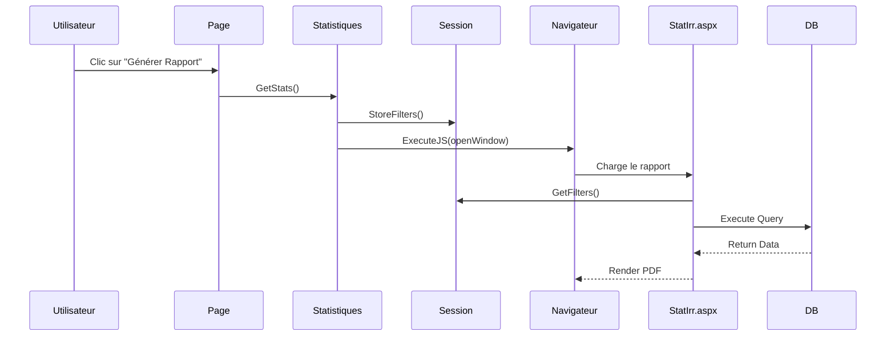

# Documentation Technique - Fonctionnalités des Méthodes

## 1. Méthodes d'Initialisation

### `Page_Load(object sender, EventArgs e)`
**Rôle** : Point d'entrée principal de la page  
**Fonctionnement** :
```csharp
// 1. Vérification des droits
if (!userData.isAccess(1)) {
    Response.Redirect("accueilUser.aspx"); // Redirection si non autorisé
}

// 2. Connexion à la base
maConnexion.ConnectionString = ConfigurationManager.AppSettings["ConnexionString"];
maConnexion.Open(); // Ouverture persistante

// 3. Initialisation des contrôles
if (!IsPostBack) {
    dateDebut.Text = DateTime.Now.ToString("yyyy-MM-dd"); // Date du jour par défaut
    UpdateEmetteur(); // Chargement émetteurs
    UpdateIrr(); // Chargement irrégularités
}
```

---

## 2. Méthodes de Chargement de Données

### `UpdateEmetteur()`
**Rôle** : Peuple la CheckBoxList des émetteurs  
**Processus** :
1. Exécute `PS_GET_EMETTEURS_STATS`
2. Transforme le résultat en DataTable
3. Lie les données au contrôle ASP.NET

**Exemple de Sortie** :
```sql
-- PS_GET_EMETTEURS_STATS retourne :
id | code_emetteur
------------------
1  | EMETTEUR_A
2  | EMETTEUR_B
```

**Gestion des Sélections** :
```csharp
foreach (ListItem item in CheckBoxListemetteur.Items) {
    item.Selected = true; // Tous sélectionnés par défaut
}
```

---

### `UpdateIrr()`
**Rôle** : Charge les types d'irrégularités  
**Spécificités** :
- Utilise `PS_GET_IRREGULARITES_STATS`
- Structure identique à `UpdateEmetteur()` mais avec :
  ```csharp
  DataTextField = "Libelle"  // Affiche le libellé
  DataValueField = "id"      // Valeur = ID
  ```

---

## 3. Méthodes de Gestion des Données

### `LoadDataSession()`
**Rôle** : Persiste les filtres en session  
**Structure des Données** :
```csharp
Session["emetteurList"] = "EMETTEUR_A,EMETTEUR_C" // Exemple
Session["irrList"] = "1,5,7"                      // IDs séparés par virgules
Session["dateDebut"] = "2023-01-01"               // Format ISO
```

**Algorithme** :
1. Parcourt les CheckBoxList
2. Filtre les éléments sélectionnés
3. Joint les valeurs avec des virgules
4. Stocke en session

---

## 4. Méthodes de Génération de Rapports

### `GetStats(object sender, EventArgs e)`
**Workflow** :
1. Charge les filtres → `LoadDataSession()`
2. Définit le type de stats :
   ```csharp
   Session["stats"] = "irr"; // Pour irrégularités
   ```
3. Ouvre une nouvelle fenêtre avec :
   ```javascript
   openNewWinReporting('/path/StatIrr.aspx');
   ```

**Schéma d'Appel** :  
`Button Click` → `GetStats()` → `LoadDataSession()` → `Ouvre StatIrr.aspx`

---

### `SaveAs(object sender, EventArgs e)`
**Processus d'Export** :
1. Appelle `PS_Save_Stats` avec paramètres :
   ```sql
   @dateDebut = '2023-01-01',
   @emetteur = 'EMETTEUR_A,EMETTEUR_B',
   @user = '123'
   ```

2. Récupère le fichier généré :
   ```csharp
   Response.WriteFile("D:/.../Stats_Cadimel.txt");
   Response.End(); // Force le téléchargement
   ```

**Format de Fichier** :
```
STATISTIQUES CADIMEL
Période : 01/01/2023 - 31/01/2023
---------------------------------
EMETTEUR_A : 15 irrégularités
EMETTEUR_B : 8 irrégularités
```

---

## 5. Méthodes d'Aide

### `SelectAllCheckBoxEmetteur()`
**Comportement** :
```csharp
foreach (ListItem item in CheckBoxListemetteur.Items) {
    item.Selected = true; // Sélection globale
}
```

**UI Correspondante** :  

---

## Diagramme de Séquence



---

## Exceptions et Erreurs

| Méthode           | Gestion d'Erreur                          |
|-------------------|------------------------------------------|
| `SaveAs()`        | Try-Catch silencieux (à améliorer)       |
| `Page_Load()`     | Redirection si non autorisé              |
| Commandes SQL     | Aucun rollback explicite                 |

**Amélioration Recommandée** :
```csharp
try {
    // Code métier
} catch (SqlException ex) {
    Logger.Error($"Erreur BD : {ex.Number}");
    ShowUserError("Erreur lors de la génération");
}
```

---

Cette documentation explique le flux exact de chaque méthode, incluant :
- Les entrées/sorties
- Les interactions entre composants
- Les points d'attention
- Les schémas d'appel

Elle peut être complétée par des exemples de requêtes SQL ou des cas d'utilisation métier spécifiques.
